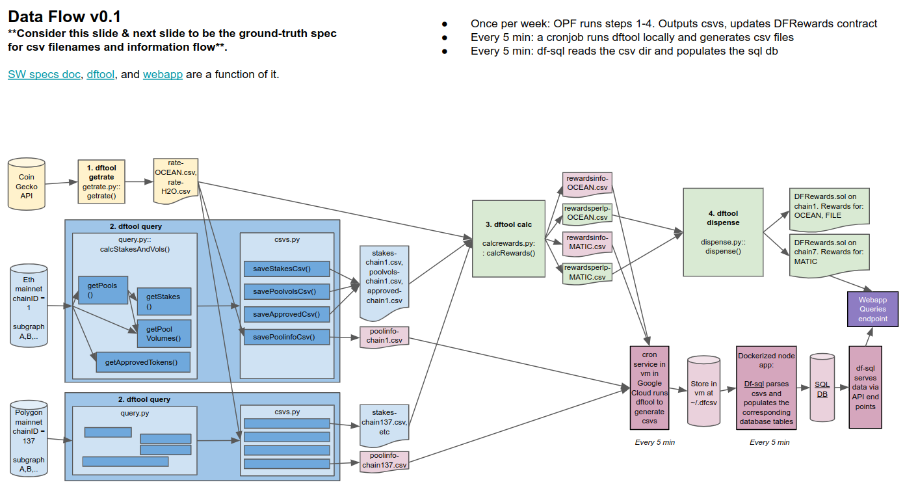
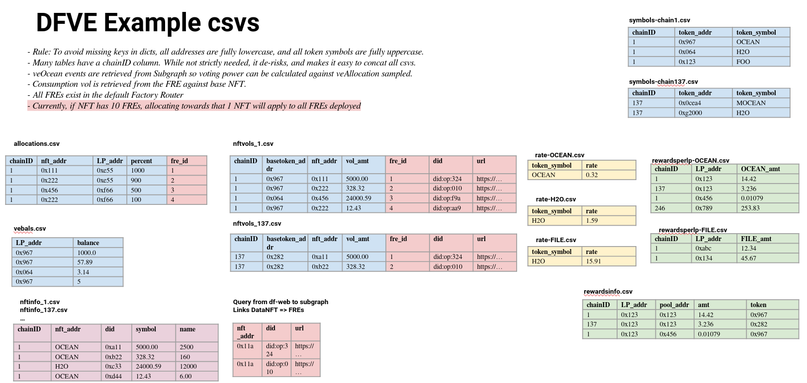

# DF-PY

<div align="center">


</div>
<br/>

CLI-based Data Farming (DF) & veOCEAN (VE) backend. It's used for weekly "dispense" ops and to create data for VE/DF frontend. 

```text
Usage: dftool getrate|query|calc|dispense|..

  dftool getrate - get exchange rate
  dftool query - query chain for stakes & volumes
  dftool calc - calculate rewards
  dftool dispense - dispense funds
  ...
```

Data flow (left) and csvs (right) ([source](https://docs.google.com/presentation/d/11Nu_emSgw3iYZKDcmnvZC_aOM00MDyYTtTWQP4PYox4/edit#slide=id.p)): 

<div>
&emsp;&emsp;

</div>
<br clear="left"/>


# Installation

### Prerequisites

Ensure prerequisites:
- Linux/MacOS
- Python 3.8.5+
- mypy, pylint, black. `sudo apt install mypy pylint black`
- solc 0.8.0+ [[Instructions](https://docs.soliditylang.org/en/v0.8.9/installing-solidity.html)]
- Any Ocean Barge pre-requisites. See [here](https://github.com/oceanprotocol/barge) 
- nvm 16.13.2, _not_ nvm 17. To install: `nvm install 16.13.2; nvm use 16.13.2`. [[Details](https://github.com/tokenspice/tokenspice/issues/165)]

#### Install & Run Barge

We use [Ocean Barge](https://github.com/oceanprotocol/barge) to run ganache, deploy contracts to Ganache, and run TheGraph with Ocean subgraphs. The deployed contracts come from github.com/oceanprotocol/contracts. df-py has a local redundant copy in its directory so that brownie easily knows what objects look like.

Let's get Barge going. Open a new terminal and:

```console
#get repo
git clone git@github.com:oceanprotocol/barge.git
cd barge

#clean up old containers (to be sure)
docker system prune -a --volumes

#run barge
#-deploys ocean contracts with addresses at ~/.ocean/ocean-contracts/artifacts/address.json
export CONTRACTS_VERSIONS=v1.1.0
./start_ocean.sh --no-aquarius --no-elasticsearch --no-provider --no-dashboard --with-thegraph
```

### Install df-py

Then, open a new terminal and:

```console
#clone repo
git clone https://github.com/oceanprotocol/df-py.git
cd df-py

#create a virtual environment
python -m venv venv

#activate env
source venv/bin/activate

#install dependencies
pip install wheel
pip install -r requirements.txt

#install openzeppelin library, to import from .sol (ignore FileExistsErrors)
brownie pm install OpenZeppelin/openzeppelin-contracts@4.2.0
brownie pm install GNSPS/solidity-bytes-utils@0.8.0

#add pwd to bash path
export PATH=$PATH:.

#compile contracts
dftool compile
```


# Main Usage: CLI

`dftool` is the main tool. In main terminal:
```console
#top-level help, lists all tools
dftool

#see help for key functions
dftool calc
dftool dispense
...
```

Then, simply follow the usage directions:)

# Usage: Running Tests

In terminal:
```console
#run tests for one method, with print statements to console. "-s" is to show output
brownie test util/test/test_calcrewards.py::test_simple -s

#run tests for one module
brownie test util/test/test_calcrewards.py

#run all tests. Note: util is the only directory _with_ tests
brownie test util

#run static type-checking. By default, uses config mypy.ini. Note: pytest does dynamic type-checking.
mypy ./

#run linting on code style. Uses .pylintrc
pylint *

#auto-fix some pylint complaints
black ./
```

Brownie uses `pytest` plus [Brownie-specific goodies](https://eth-brownie.readthedocs.io/en/stable/tests-pytest-intro.html).

# Usage: Configure Remote Networks

Examples so far were on a local chain. Let's do a one-time setup for remote networks. In console:
```console
brownie networks add bsc bsc host=https://bsc-dataseed1.binance.org chainid=56  
brownie networks add polygon polygon host=https://polygon-rpc.com/ chainid=137  
brownie networks add energyweb energyweb host=https://rpc.energyweb.org chainid=246  
brownie networks add moonriver moonriver host=https://rpc.api.moonriver.moonbeam.network chainid=1285
```

Now, you can use those networks simply by specifying a different chainid in `dftool` calls.

# Usage: Rewards Distribution Ops

See [README-dist-ops.md](README-dist-ops.md)

# Usage: DFRewards Owner Control Ops

See [README-control-ops.md](README-control-ops.md)

# Usage: Via Docker

Build the docker image.
```shell
docker build . -t dfpy
```

Usage:
`./dfpy_docker args`

Docker will mount `/tmp/dfpy:/app/data`
Which will be located inside of `/root/.dfcsv`

Example usage with docker:

```shell
./dfpy_docker help  # prints help 
```

```shell
$ ./dfpy_docker getrate OCEAN 2022-01-01 2022-01-02 /app/data

Arguments: ST=2022-01-01, FIN=2022-01-02, CSV_DIR=/app/data
rate = $0.8774 / OCEAN
Created /app/data/rate-OCEAN.csv
```

# Usage: Docker + Brownie Networks

Since df-py uses brownie to execute a wide range of commands, you may want to install additional networks in brownie.
You may want to expand brownie's configured networks in the Docker container by editing the `Dockerfile`
```
...
RUN brownie networks add bsc bsc host=https://bsc-dataseed1.binance.org chainid=56  
RUN brownie networks add polygon polygon host=https://polygon-rpc.com/ chainid=137  
RUN brownie networks add energyweb energyweb host=https://rpc.energyweb.org chainid=246  
RUN brownie networks add moonriver moonriver host=https://rpc.api.moonriver.moonbeam.network chainid=1285  
...
COPY . .
RUN rm -rf build
```

# Usage: Docker + Contract Addresses

Since df-py has to connect to a broad range of contracts, you may need to configure the docker container to access these. You can [find the latest deployed contracts here](https://github.com/oceanprotocol/contracts/blob/v4main/addresses/address.json).  
You will then have to copy them to your local directory, and configure `dfpy_docker` like so.
```
docker run --env-file ./.env -v /tmp/dfpy:/app/data -v /app/df-py/address.json:/address.json --rm dfpy $@
```

# Usage: Configuring Data Farming Data Flows + dfpy-sql-backend + df-web

`dfpy-sql-backend` consumes data that is generated from `df-py` in order to feed it via an API to `df-web`
You can [find a very high level diagram for this here](https://github.com/oceanprotocol/dfpy-sql-backend).

In order to set this up, we create a new bash script called `getAllRecords-dfpy-sql` and add it to our local crontab. Please note the folders you will have to created, such as `/tmp/dfpy/` and `~/.dfcsv/

### getAllRecords-dfpy-sql.sh
```
cd /app/df-py/
date=`date -dlast-wednesday '+%Y-%m-%d'`
now=`date '+%Y-%m-%d'`

/app/df-py/dfpy_docker getrate OCEAN $date $now /app/data && 
/app/df-py/dfpy_docker query $date latest 1 /app/data 1 && 
/app/df-py/dfpy_docker query $date latest 1 /app/data 56 && 
/app/df-py/dfpy_docker query $date latest 1 /app/data 137 && 
/app/df-py/dfpy_docker query $date latest 1 /app/data 246 && 
/app/df-py/dfpy_docker query $date latest 1 /app/data 1285 && 
/app/df-py/dfpy_docker calc /app/data 10000 OCEAN && 
mv /tmp/dfpy/* ~/.dfcsv/
```

We then add this to our crontab
```
*/10 * * * * /app/df-py/getAllRecords-dfpy-sql.sh
```

`dfpy-sql-backend` attempts to read all csv files inside of `~/.dfcsv/`.
You can adjust this by changing this path in both repositories and redeploying.

# Usage: Hardware Wallets

Here are the steps:
- Install geth - this will also install clef.
- Launch clef in terminal 1
- Connect hw wallet to pc
- Call brownie.network.accounts.connect_to_clef() function in terminal 2
- Accept the connection request from terminal 1
- To access the accounts in hw use: brownie.network.accounts

(Discussion in [this issue](https://github.com/oceanprotocol/df-issues/issues/66).)

# Usage: Brownie Console

From terminal:
```console
brownie console
```

In brownie console:
```python
>>> t = Simpletoken.deploy("TEST", "Test Token", 18, 100, {'from': accounts[0]})
Transaction sent: 0x3f113379b70d00041068b27733c37c2977354d8c70cb0b30b0af3087fca9c2b8
  Gas price: 0.0 gwei   Gas limit: 6721975   Nonce: 0
  Simpletoken.constructor confirmed   Block: 1   Gas used: 551616 (8.21%)
  Simpletoken deployed at: 0x3194cBDC3dbcd3E11a07892e7bA5c3394048Cc87

>>> t.symbol()                                                                                                                                                                                              
'TEST'
```
